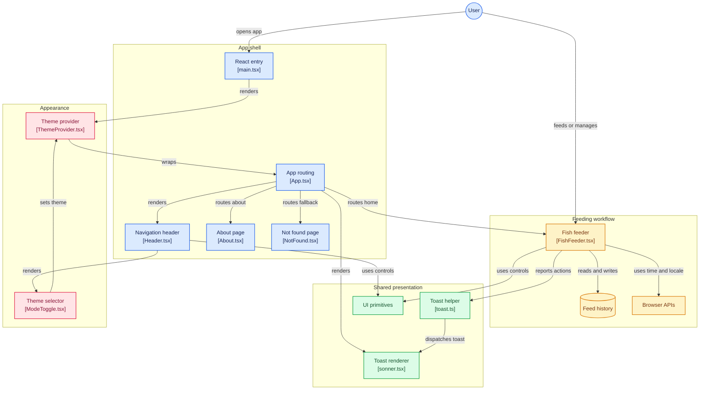

# Did I Feed My Fish Today?

A tiny, practical app for anyone who just wants to know **if they fed their fish today** 🐟—quick, simple, no extra clutter.

## Demo


## Features

* Check if your fish have been fed today
* Record when you last fed your fish
* Undo the last feed if needed
* Clear feed history for a fresh start
* Set a preferred feeding time for reminders
* Toggle between light and dark mode
* **Times are based on your browser’s language/locale**
* **Keyboard shortcuts:** `F` = Feed, `U` = Undo

## Tech Stack

* [React](https://reactjs.org/)
* [TypeScript](https://www.typescriptlang.org/)
* [Tailwind CSS](https://tailwindcss.com/)

## Application Architecture



## Getting Started

1. **Clone the repo:**

   ```bash
   git clone https://github.com/MJunhaoChen/did-i-feed-my-fish-today.git
   cd did-i-feed-my-fish-today
   ```
2. **Install dependencies:**

   ```bash
   npm install
   ```
3. **Run the app:**

   ```bash
   npm run dev
   ```
4. **Open in your browser:**
   Visit [http://localhost:8080](http://localhost:8080)

## Usage

* Tap the feed button or press **F** to mark a feed
* Undo last feed with the button or **U**
* Clear feed history for a fresh start
* Use preferred feeding time to get reminders
